# 발표자료 — OpenStack 멀티노드 IaaS 구축 (김현도)

> **목적:** VMware + Kolla-Ansible 기반 **멀티노드 OpenStack** 환경을 설계·구축·검증한 결과를 정리한다.  
> **검증 일시:** 2026-07-06 · **최종 구성(2026-07-14):** tenant VM **9/9 ACTIVE** (`automation-01` 삭제)  
> **캡처:** `images/captures/` — Notion·발표 슬라이드용 (**13장**, 2026-07-06 촬영 · server list는 9대 기준으로 재촬영 권장)
> 
## 1. 한 줄 요약

| 항목 | 내용 |
|------|------|
| 플랫폼 | VMware Workstation Pro + Ubuntu 24.04 + Kolla-Ansible 2025.1 |
| 구성 | 인프라 **7노드** (mgmt + control / network / storage / compute×3) + tenant **9대** |
| 핵심 | 멀티 compute 분산, anti-affinity, public/private 이중망, FIP, Cinder, **mgmt 설계** |
| 검증 | Horizon + OpenStack CLI 캡처 **13장** (`images/captures/`) |
| 실시연 | 강사 PC **mgmt+올인원 2VM**, Swarm **원노드** (본 문서는 **구축 증명**용) |

---

## 2. 전체 아키텍처

```
VMware Workstation Pro
├─ mgmt-01          (.200)  외부 관리 / Ansible / SSH 진입점
├─ control          (.100)  OpenStack Controller + API (Horizon VIP .105)
├─ network          (.101)  Neutron L3 / DHCP / OVS
├─ storage          (.102)  Cinder (LVM)
├─ compute-node-01  (.103)  Nova Compute
├─ compute-node-02  (.104)  Nova Compute
└─ compute-node-03  (.106)  Nova Compute

Tenant (OpenStack 인스턴스 9대)
├─ compute-01: swarm-mg, db01, db_proxy-01, lb-01
├─ compute-02: swarm-mg2, db02, db_proxy-02, lb-02
└─ compute-03: swarm-mg3
```

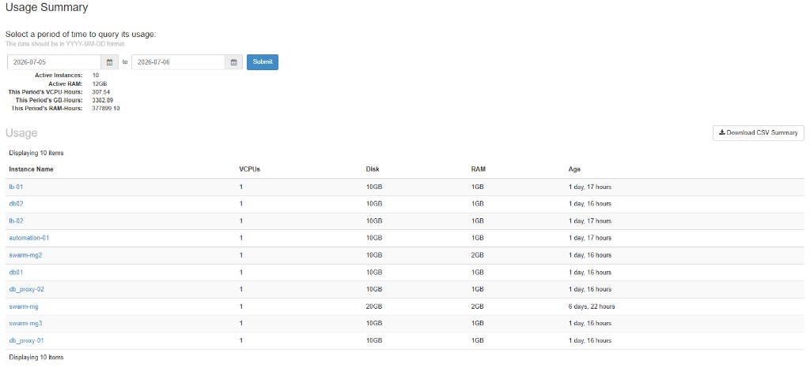

---

## 3. 인프라 노드 · Horizon

| 노드 | IP | 역할 |
|------|-----|------|
| **mgmt-01** | **172.16.8.200** | 외부 관리 / Ansible / SSH 진입점 |
| control | 172.16.8.100 | Controller + API |
| network | 172.16.8.101 | Neutron |
| storage | 172.16.8.102 | Cinder LVM |
| compute×3 | .103 / .104 / .106 | Nova Compute |
| Horizon VIP | 172.16.8.105 | `http://172.16.8.105` |

**Horizon 쿼터 (최종 구성):** Instances **9** · VCPU/RAM·Volume·FIP는 환경에 따라 변동  
(2026-07-06 당시 캡처 `02`/`03`은 10대 시점일 수 있음 → 발표 시 9대 CLI 캡처 병행)

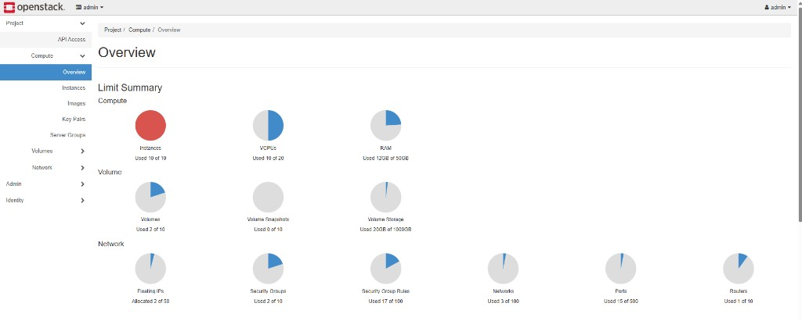

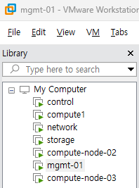

---

## 4. 네트워크 설계

| 구분 | 이름 | CIDR |
|------|------|------|
| External | `public1` | 172.16.8.0/24 |
| Tenant Public | `project-public-net` | 192.168.100.0/24 |
| Tenant Private | `project-private-net` | 192.168.101.0/24 |
| Router | `project-router` | public1 ↔ tenant |

**망 규칙:** `192.168.100.x` = public · `192.168.101.x` = private

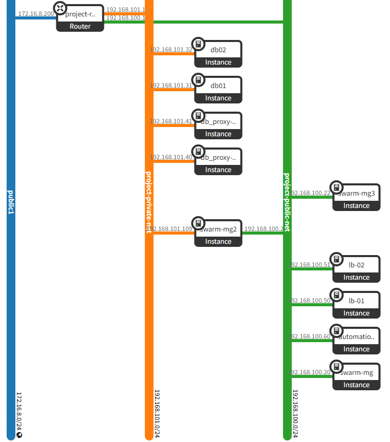

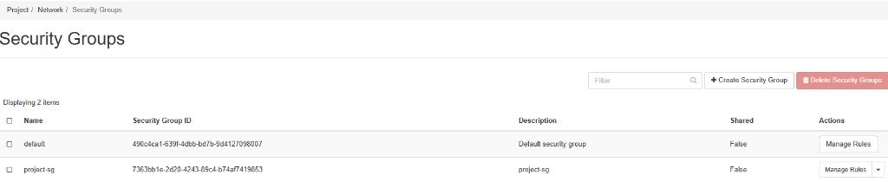

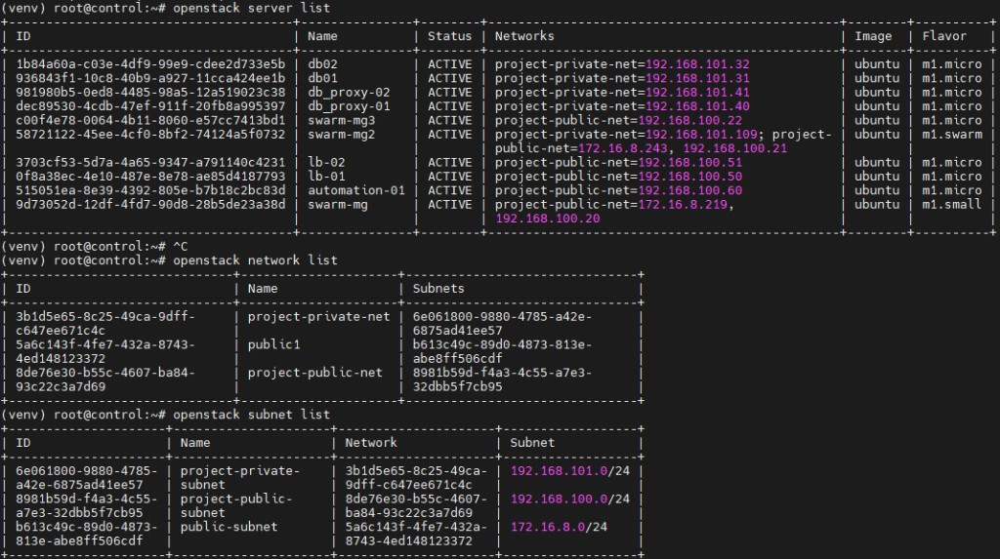

---

## 5. Tenant VM 목록 (최종)

| 이름 | Fixed IP | FIP | Flavor | 상태 |
|------|----------|-----|--------|:----:|
| swarm-mg | .100.20 | .219 | m1.small | ACTIVE |
| swarm-mg2 | .100.21 | .243 | m1.swarm | ACTIVE |
| swarm-mg3 | .100.22 | — | m1.micro | ACTIVE |
| db01 | .101.31 | — | m1.micro | ACTIVE |
| db02 | .101.32 | — | m1.micro | ACTIVE |
| db_proxy-01/02 | .101.40/41 | — | m1.micro | ACTIVE |
| lb-01/02 | .100.50/51 | — | m1.micro | ACTIVE |

> `automation-01`(.100.60) — **2026-07-14 삭제** (최종 구성 제외)

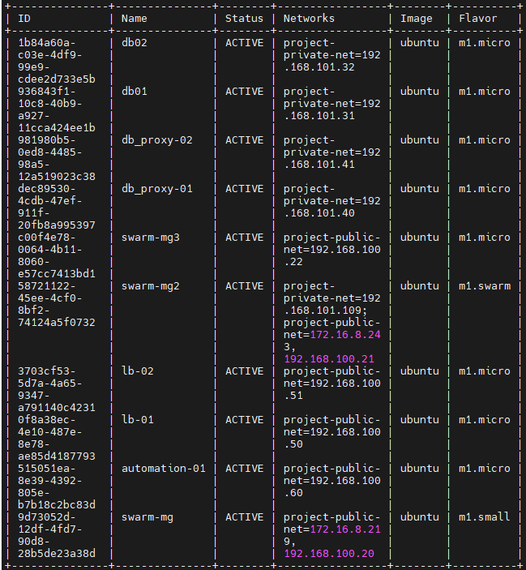

---

## 6. Compute 분산

```
compute-01 (.103)     compute-02 (.104)     compute-03 (.106)
├─ swarm-mg           ├─ swarm-mg2          └─ swarm-mg3
├─ db01               ├─ db02
├─ db_proxy-01        ├─ db_proxy-02
└─ lb-01              └─ lb-02
```

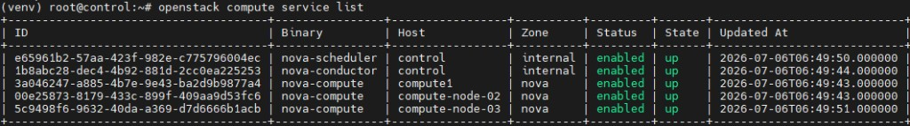

---

## 7. Anti-Affinity Server Group

| Server Group | 정책 |
|--------------|------|
| `db-server-group` | anti-affinity (db01, db02) |
| `swarm-server-group` | anti-affinity (swarm-mg, mg2, mg3) |

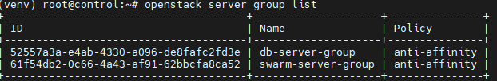

---

## 8. Floating IP

| FIP | Fixed IP | VM |
|-----|----------|-----|
| 172.16.8.219 | 192.168.100.20 | swarm-mg |
| 172.16.8.243 | 192.168.100.21 | swarm-mg2 |

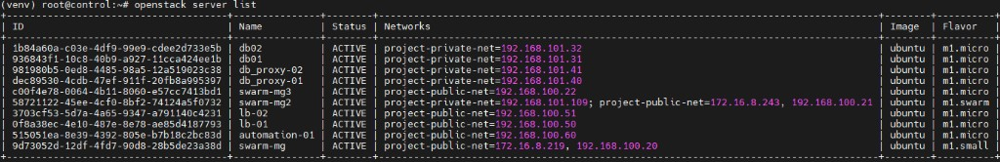

---

## 9. Cinder 볼륨

| 볼륨 | 크기 | VM | 상태 |
|------|------|-----|:----:|
| db01-data | 10GB | db01 `/dev/vdb` | in-use |
| db02-data | 10GB | db02 `/dev/vdb` | in-use |

- `cinder-volume @ storage@lvm-1` — **up**
- `cinder-backup` — down (미사용, 발표 무관)

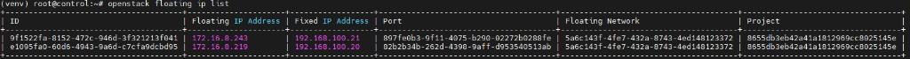

---

## 10. Security Group

| 이름 | ID |
|------|-----|
| `project-sg` | `7363bb1e-2d20-4243-89c4-b74af7419853` |

포트: 22, 80/443, 2377, 7946, 4789, 3306, 9090, 3000 등 (상세: `08-산출물` §3)

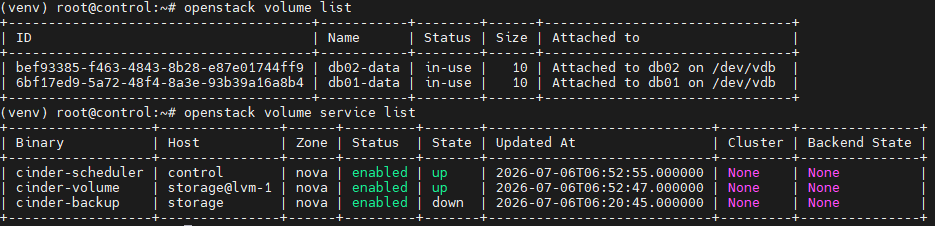

---

## 11. mgmt 노드 & SSH (설계 — 발표는 구두)

> mgmt VM 존재 + **ProxyJump SSH 설계**. 라이브 데모·캡처 증명 생략. tenant SSH는 control + `project_key` CLI로 검증.

```
mgmt-01 (.200)  →  control (.100)  →  tenant VM
   관리/Ansible        -J ProxyJump      project_key
```

**발표 멘트:** 「mgmt `.200`에 관리 노드를 두고, FIP망 직접 접근 불가 → control 경유 ProxyJump로 tenant 운영 설계. project_key는 mgmt에 배포.」

---

## 12. CLI 검증 묶음 (보조)

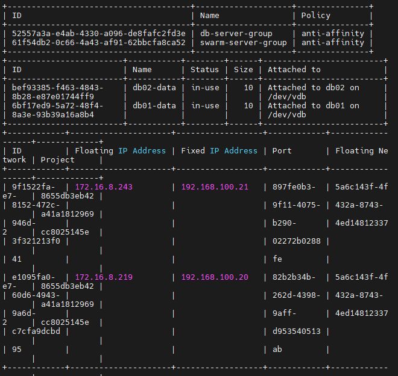

```bash
source /etc/kolla/admin-openrc.sh
openstack compute service list
openstack server list
openstack server group list
openstack volume list
openstack floating ip list
openstack network agent list
```

---

## 13. 구축 과정 요약 (발표 멘트)

1. Kolla-Ansible 멀티노드 배포 (control / network / storage / compute×3)
2. public1 + project public/private + router
3. Image·Flavor·SG·Keypair
4. compute-02 신규 제작 (클론 금지)
5. compute-03 추가 → swarm 3분산
6. tenant **9대** · IP표·배치 준수 (`automation-01` 최종 제외)
7. anti-affinity + Cinder db 볼륨
8. FIP 2개 · mgmt-01 + ProxyJump 설계

---

## 14. 실시연 vs 본 구축

| 구분 | 본 구축 (발표) | 강사 PC 실시연 |
|------|----------------|----------------|
| OpenStack | 멀티노드 6VM + mgmt | 올인원 1VM |
| 관리 | mgmt ProxyJump 설계 | mgmt + 모니터링 |
| Swarm | 3노드 분산 설계 | 원노드 |
| 증명 | **CLI·Horizon 캡처 13장** | 데모 단순화 |

---

## 15. 캡처 체크리스트 (완료)

| # | 내용 | 상태 |
|:-:|------|:----:|
| 1 | VMware 7노드 ON | ✅ |
| 2 | compute service list | ✅ |
| 3 | server list **9 ACTIVE** (최종) | ✅ |
| 4 | volume list in-use | ✅ |
| 5 | floating ip list | ✅ |
| 6 | network agent list | ✅ |
| 7 | server group list | ✅ |
| 8 | Horizon Overview / Usage | ✅ |
| 9 | Network Topology | ✅ |
| 10 | Security Groups | ✅ |
| 11 | mgmt SSH 라이브 | ⬜ 설계만 (의도적 생략) |

---

## 16. 관련 문서

| 문서 | 용도 |
|------|------|
| `08-산출물-8종-인수인계.md` | 상세 인수인계 |
| `문서화-마스터표.md` | 1페이지 요약 |
| `images/captures/README.md` | 캡처 파일 목록 |

---

**작성:** 김현도  
**최종 갱신:** 2026-07-14 (`automation-01` 삭제 · tenant 9대)
